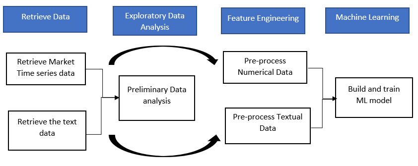
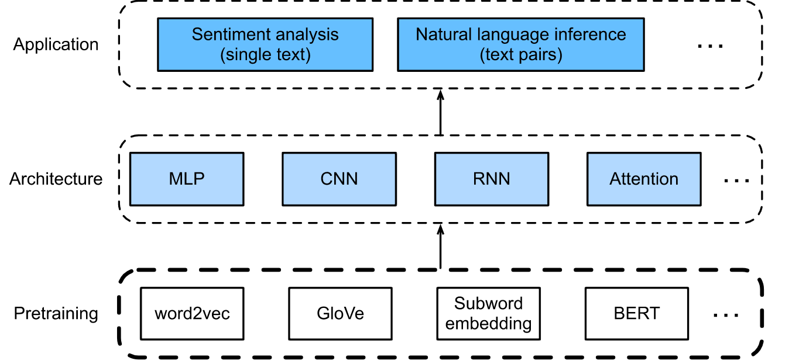

# PredictFinancialMarketsByAnalyzingSpeechByCentralBanks

## Project Repository for Data Science for Text Analytics 

Project Name: Predict Financial Markets By Analyzing Speech By Central Banks

# Group Members:

Anusha Chattopadhyay - anusha.chattopadhyay@stud.uni-heidelberg.de

Keerthan Ugrani - ugranikeerthan6@gmail.com

Renuka Jawaharlal Sahani - renukasahani16@gmail.com

Shruti Ghargi - shruti.ghargi@gmail.com

#scroll to the last section for logs
# Resources
project training data from the challenge https://challengedata.ens.fr/challenges/70

initial test data also from the same challenge

creating fresh final test data after bert transformation - aritcles from https://www.kaggle.com/datasets/magnushansson/central-bank-speeches?resource=download 

First set of financial market data from https://www.cboe.com/tradable_products/vix/vix_historical_data/

-------------------------------------------------------------------------------------------------------------------------------------------------
requiremnts.txt contains the actively being used libraries:(updated by team whenever new libraries are required)

--------------------------------------------------------------------------------------------------------------------------------------------------

Project Proposed Architecture

Project Flow Chart
-------------------------------------------------------------------------------------------------------------------------------------------------
# Status of project as of 23/01/2023 - the main.py file doesn't have any imports as of now and mainly serves as a placeholder, most progress is in the .ipynb files in the src/snippets folder. the main.py folder is mainly kept empty as we have till this stage worked independently. However the process of compilation is being tested in another branch. An inital Approach to the model has been attempted. Working on the new test set of data. New test data aquired and compiled

# tasks completed - update
1. initial data acquired
2. Folder structure and repo initalization done (subject to change as main model gets built)
3. Initial Project Architecture plotted
4. Static loading of files completed
5. Max and Min plotted for each market and it's corresponding article plotted - plotted in ipynb file
6. Simple Moving average for all markets at 2weeks plotted - plots stored in separate plots/simple_moving folder
7. Corelation Matrix From 1st day to 1st week and 2nd week after the speech is delivered plotted - plotted in ipynb file
8. files all carried in snippets and put in snippets folder
9. Market articles aquired from https://www.kaggle.com/datasets/magnushansson/central-bank-speeches?resource=download 
10. VIX market data aquired from from 2009 to 2003 aquired, along with updating data from 2004 to present from https://www.cboe.com/tradable_products/vix/vix_historical_data/
11. Model A created for training initial Data, test with Model A remaining
12. Raw data to be stored in financial_data_articles_raw
13. Processable Data created and set up, zip stored in Data/ folder
14. Market data and articles formatted ready for bert transformation, excluding combination

# tasks pending/ongoing -
1. Article data and market data formatted separately and added. Combination along with 1w and 2w dates remaining
2.	Text analytics:
i.	Building the vocabulary of the text data.
ii.	First 5 to 10 elements and their counts.
iii.	Import the embeddings that we want to use in our model and for that, we need to check the intersection of our vocabulary data/ text data with the provided embeddings.
iv.	This intersection will output a list of vocabulary (OOV) words that we can use to improve our pre-processing.
v.	Then check the coverage.
vi.	Check for the top OOV and also the punctuation, while removing or deleting the punctuation marks we need to check whether the punctuation needs to be deleted or considered as a token.
vii.	Then split off the punctuation which is considered as a token and remove other punctuation from the data.
viii.	Then check for the embedding and our data coverage.
ix.	Check for the numbers in the dataset as the bank statements can contain many numerical data as well, and check how the numbers are represented in the embeddings.
x.	Again, check for the OOV and remove the words since those have obviously been down-sampled when training the embeddings.
xi.	If there is an increase in the vocab coverage and data coverage is more than 80% and 90% respectively, then we can go ahead with BERT transform.

3.	visual representation:
once we have the text data and are done with the analysis then we can proceed with which part of our analysis can be represented visually

4.	Model training + getting the result: Model Training: 
i.	Split entire test data into 80-20 test-train sets
ii.	Training with XG BOOST and LSTM machine learning algorithms
iii.	Comparison of ML algo accuracies
iv.	Representation of the results

5.	Fine-tune the model that has got a better accuracy and check the results
6.	Creating a Full stack application for the model

--------------------------------------------------------------------------------------------------------------------------------------------------

# Notes for Repo contributers

# repository overview - as of december 12/12/2022
1. Training and test data are in the data folder
2. Models folder is for storing trained models
3. The plots folder is for any plots you may want to save as .png or any other format
4. src/snippets is for independent code files: or files that can run on their own or were created as external .pynb files and then added into the repo
    this code is meant to be eventually integrated into the main.py file
5. The main.py file is for compilation of the snippets and other external file. ideally this should have minimal algorims in it and mostly imports.
# guidelines
1. Please PULL before you push before every editing session, to avoid merge conflits while pushing.
2. Please avoid non specific commits such as  "small changes" , "bug fix (with no description of which bug)".
3. Please create a pull request or contact the members before making a large change on a file you aren't solely working on (non snippet file) or is a dependency for a file someone else is working on
4. For Vscode users, git lens is recommended
5. Refering to point 2, try to not keep the same commit for a large commit, ideally commits should be in small batches so the other contributers can read them easily.
6. After a push, please also update the logs in the README file as frequently as possible.

# git commands cheat sheet
 - please don't directly push to main, create a PR and request review or directly contact another member to review before you push. if unsure please just create a PR and wait after requesting review, (patience is a virtue ;-) ) .
1. git pull origin - update your local with your active branch
2. git pull origin main - update your local branch with the latest updates from main
3. git merge --abort - to cancel your merge incase conflicts occur

---------------------------------------------------------------------------------------------------------------------------------------------------

# log contributer - for detailed logs, with timings, please refer to the commits page, but we are trying to keep this readme as updated as possible as well
-----------------------------------------------------------
Readme, Logs and repo maintenance main - Anusha Chattopadhyay
-------------------------------------------------------------

Data Files Acquired- Keerthan Ugrani

Git Repo Creation - Anusha Chattopadhyay

Folder Creation data,src and models - Renuka Jawaharlal Sahani

Uploaded datasets in data folder - Renuka Jawaharlal Sahani

Project Architecture Diagram - Keerthan Ugrani

Wrote static pynb file in src snippets for load the market data size of the column mean median sd for combined as well as one day one week or two week.- Renuka Jawaharlal Sahani

Computed the highs and lows for each stock market company for 1st day, 1st week and 2nd week- Shruti Ghargi

Plotted High and Low graph for visualization (in ipynb file, not stored separately for now) - Shruti Ghargi

Added the pynb script for High and Low values of the stock market - Shruti Ghargi

Plotted the Moving average for the market results data in y_train file - Anusha Chattopadhyay

Added pynb script for moving average plots - Anusha Chattopadhyay

pynb files added to snippets folder - Anusha Chattopadhyay

Plots extracted and saved in plots/data(will tie everything with the main.py file at a later date) - Anusha Chattopadhyay

Analysis of the correlation of 13 markets on 1st day, 1st week and 2nd week after the speech was delivered. - Keerthan Ugrani

Choosing the perfectly correlated data and assigning it to the variable - Keerthan Ugrani

data paths updated for the pynb files so as to match the new data folder path - Anusha Chattopadhyay

Researched on getting the alternate dataset which is in text format. Acquired central bank speeches dataset from: https://www.kaggle.com/datasets/magnushansson/central-bank-speeches?resource=download The dataset contains speeches (in English) held by central bank boards affiliated with the Bank for International Settlements over the period 1997-01-07 to 2020-01-10. This can be our raw articles dataset and we are yet to get respective market values for it- Shruti Ghargi

Raw articles for financial market added , market data for available dates pending - Anusha Chattopadhyay

VIX-Market data uploaded - Anusha Chattopadhyay

Implemented XG Boost with the Bert Data and Trained the model   - Renuka Jawaharlal Sahani

Did cleaning with PCA Analysis method to reduce the dimensionality of a dataset - Renuka Jawaharlal Sahani

Trained the Model via Principal Components - Renuka Jawaharlal Sahani

Implemente the T-SNE Implementatione - Renuka Jawaharlal Sahani

Implemeted the code to convert final data to final_normal_submission.csv file which will be output result - Renuka Jawaharlal Sahani

VIX market data from 2009 to 2003 aquired, along with updating data from 2004 to present from https://www.cboe.com/tradable_products/vix/vix_historical_data/ - Anusha Chattopadhyay

Raw data stored in financial_data_articles_raw - Anusha Chattopadhyay

Uploaded First implemented code test reult file on challenge data webiste on 25th dec 2022- Renuka Jawaharlal Sahani

Uploaded Second implemented code test reult file on challenge data webiste on 25th Jan 2023 - Renuka Jawaharlal Sahani

Caputred the screenshot and uploaded on github(benchmark results which we achieved) - Renuka Jawaharlal Sahani

Did changes to the old xgboost code implemeted by me.Which is now without randomization.This code crossed the bench mark - Renuka Jawaharlal Sahani

Wrote steps how to execute the model - Renuka Jawaharlal Sahani

Updated requirement.txt - Renuka Jawaharlal Sahani

Added processed csv into data into .zip - Anusha Chattopadhyay

Driver code added to snippets - Anusha Chattopadhyay

Project progress and checklists updated - Keerthan Ugrani, Shruti Ghargi

Article data and market data formatted separately and added. Combination along with 1w and 2w dates remaining - Anusha Chattopadhyay
